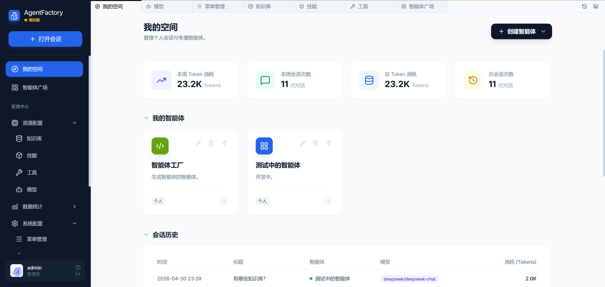
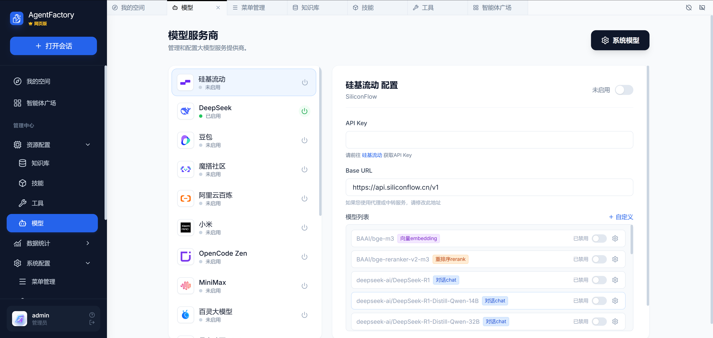

# AgentFactory | 智能体工厂

AgentFactory 围绕「智能体」核心设计，支持 **Agent 生产 Agent**（智能体工厂模式），帮助企业快速构建、迭代和规模化部署智能体应用。 

## ✨ 核心亮点 

- **100% Agent 导向架构**：从 UI 到后端，所有模块均为 Agent 服务。每一个功能本身也是一个可被 Agent 调用的「内置工具」。 
- **Agent 生产 Agent**：内置智能体工厂引擎，支持通过自然语言或配置模板，**让一个 Agent 自动生成、测试、部署另一个 Agent**。
- **企业级设计**：权限隔离、审计日志、SLA 监控、模型成本控制。 
- **完全开源**：MIT 协议，欢迎企业与开发者共建。 

> 以下功能描述中，带 【】 为规划中的功能。

## 📋 主要功能 

### 我的空间（My Workspace） 
- 个人专属 Agent 管理空间
- 一键创建、【版本管理、监控与回滚】
- 支持 Agent 生命周期全流程（设计 → 试用 → 发布 → 维护） 

### 智能体广场（Agent Marketplace） 
- 企业内部 Agent 共享市场 
- 搜索、复制、【组合现有 Agent】
- 权限控制：公开、团队可见、指定人员三种模式 

### 知识库（Knowledge Base） 
- 企业级 RAG 知识库 Ragflow（支持多种文档格式） 
- 向量化 + 知识切片
- 数据集权限：公开、团队可见、指定人员三种模式
- Agent 可实时查询、【更新数据集】

### 技能和工具（Skills & Mcp Tools） 
- 可复用的 Agent 技能和工具包 
- 内置 10+ 企业常用工具
- 支持自定义工具（Python / API 形式）

### 模型（Model ） 
- 支持主流大模型（OpenAI、DeepSeek、硅基流动及Ollama 本地模型等） 
- 多模型并行 + 智能体专属模型配置 

### 智能体工厂（Agent Factory）★ 开发中
- **自然语言生成 Agent**：输入「帮我做一个销售跟单 Agent」，系统自动根据企业资源生成完整 Agent（Prompt + Tools + Knowledge + SubAgent） 
- **Agent 克隆与进化**：基于现有 Agent 快速生成变体 
- **自我优化**：Agent 可根据运行日志自动迭代自身 Prompt 和工具配置 

## 🛠 技术架构
- **前端**：Vue3 + Tailwind CSS  
- **后端**： [FastapiAdmin](https://github.com/fastapiadmin/FastapiAdmin)
- **Agent 引擎**：Agno / OpenHarness
- **知识库**： Ragflow 
- **缓存**：Redis

## 🚀 快速开始 

### 📖 文档 
- [快速上手](./docs/getting-started.md) 
- [初次运行](./docs/initial-run.md)
- [操作手册](./docs/operation-manual.md)

## 🏗 Roadmap 
- **v0.1**：基础 Agent 管理 + 权限管理 
- **v0.2（当前）**：AgentFactory 智能体工厂
- **v0.3（下个版本）**：定时器和更多的内置工具
- **Todo**: Desktop 桌面端 

## 📄 开源协议
[MIT License](./LICENSE)  © 2026 AgentFactory 

⭐ 如果您觉得这个项目有价值，请给我们一个 Star！ 